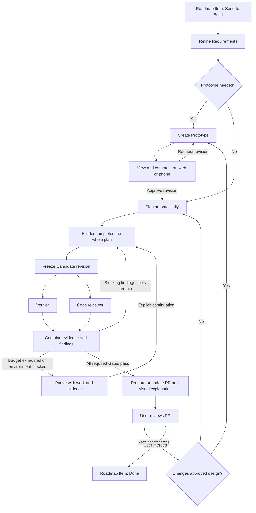

# Build workflow plan

Status: implemented for new version-2 Builds, including repeatable agent-led Prototype review rounds. Legacy Builds retain their existing workflow. This document records the agreed behavior and implementation boundaries.

## Product outcome

Send a Roadmap Item to Build. Factory refines the Requirements, handles any required prototype, plans automatically, and carries the whole change through implementation, verification, code review, and PR preparation. The normal approval points are the Prototype and the PR. Agents ask about missing decisions only when they materially affect scope or behavior.

New components and substantial UI redesigns require a Prototype. Small visual fixes use before/after evidence, with an option to require a Prototype. Work without a Prototype proceeds from refinement to planning.

Prototype approvals are tied to one preserved Prototype revision. Verification and code review are tied to one exact Candidate revision. A later edit invalidates earlier evidence.

## Project setup and role settings

An agent discovers the Project's setup, check, and preview commands, supported verification targets, and useful repo guidance once. Store the resulting configuration for subsequent Builds; individual Builds can override it. A missing prerequisite becomes a visible blocker rather than a silent skipped Gate.

Each Project stores reusable Provider, model, effort, and selected Skills for the prototype, planner, builder, verifier, and code-review roles. Snapshot the settings at Build creation and resolve selected Skill content/version before the first role Session starts, so later settings or Skill changes do not silently alter active work. Factory uses the existing machine/Project Skill catalog rather than maintaining a second catalog.

Prototype and planner work is outside the three-agent Candidate loop. Evidence and PR preparation happens after that loop passes and cannot silently change the reviewed product code.

| Role | Responsibility | Output and boundaries |
| --- | --- | --- |
| Prototype | Explore substantial UI changes against Requirements | Clickable HTML, relevant states, a preserved revision; no production implementation |
| Planner | Turn Requirements and the approved design into an executable plan | Ordered Checkpoints, verification coverage, assumptions; no routine plan-approval pause |
| Builder | Implement the entire plan or fix consolidated findings | Product code and meaningful tests; only this role edits product code |
| Verifier | Exercise the real feature and check Requirements | Executed check results, Requirement evidence, UI screenshots and discrepancies |
| Code reviewer | Examine the Candidate diff against the plan and Requirements | Findings with severity, location, impact, and concrete evidence; no product-code edits |

Each Candidate has fresh builder, verifier, and code-review Sessions. Handoffs include the Roadmap Item, refined Requirements, approved Prototype revision, plan, Project configuration, and previous findings. The verifier and reviewer inspect the same frozen Candidate, with isolated execution where necessary. Collect both reports before fixing a completed Candidate, even if verification finds a product failure. Do not fabricate a missing report when the environment prevents review.

Enforce role permissions in execution, not only prompts. Current Build reviewers run with full access; implementation must establish read-only product-code access or isolated Candidate execution with appropriate access controls. Runtime output and evidence may be written separately. Unexpected product-code changes invalidate the review and must not be accepted as a verifier fix.

## Prototype review inside Factory

Provide interactive HTML viewing and feedback on both web and phone. Keep general comments and comments pinned to locations in the preview. Each thread belongs to a preserved Prototype revision and supports resolved/unresolved state.

Comments accumulate without launching agents. Request revision sends the collected feedback to an agent and produces a new preserved revision. After the initial Prototype and every updated revision, the agent presents the result and asks whether anything needs changing. The user can give further revision instructions or approve the Prototype; an explicit revision instruction authorizes the next update.

Repeat this agent update → user review → requested changes cycle as many times as needed until the user approves. Prototype review rounds are outside the three-attempt implementation budget. Each revision request initiates one revision task and a new review round; Project time/runtime and measurable cost controls still apply. Approval names the revision currently being viewed, and its design becomes input to automatic planning and UI verification.

If later feedback changes the approved layout or behavior, return to Prototype review and approval. If it asks the builder to match the existing approved design, proceed directly to implementation fixes.

Serve Prototype content as an isolated review artifact. Access follows Factory's existing Worker/device authorization; prototype scripts must not receive mailbox APIs or household credentials. Preserve comment anchors with enough preview context to identify their locations across screen sizes and revisions.

## Whole-Build Candidate budget

A Batch authorizes up to three builder attempts over the entire Build, including the first. Checkpoints organize implementation; they do not have separate Candidate budgets or independent autonomous review loops.

Reserve a slot atomically when the builder starts. An implementation that fails before becoming a complete Candidate still consumes that slot. This closes the loophole where incomplete implementations could retry indefinitely.

A Worker crash, lost connection, or unavailable verification environment pauses the same work. Recovery does not silently reset the budget. Rerunning verification of unchanged code does not reserve another slot. Changes to product code require a new Candidate and invalidate the previous verdicts.

Blocking findings return to a fresh builder Session while slots remain. After the third unsuccessful attempt, pause with the work, Sessions, findings, and evidence preserved. No fourth attempt starts automatically.

Distinguish these controls:

- **Resume:** recover interrupted or environment-blocked work within its current Batch and consumed budget.
- **Continue:** explicitly authorize a new three-attempt Batch after the budget is exhausted.
- **Request changes:** explicitly authorize a new Batch for the user's requested changes on the same Build and PR, passing through Prototype approval again when needed.
- **Pause:** stop active execution while preserving work, evidence, and the consumed budget.
- **Stop:** terminate the Build's automatic work while preserving its history and existing PR for inspection.

Provide configurable role timeouts and a Build-wide runtime ceiling. Enforce spending limits where Provider usage can be measured reliably; otherwise expose supported time/token bounds without claiming an exact monetary cap. Continuation renews the Candidate budget, not the lifetime resource ceiling; raise an exhausted ceiling explicitly before further work. Numerical defaults belong to Project configuration and remain adjustable.

## What passes and what blocks

A Candidate is ready for PR review only when applicable checks have executed successfully, every Requirement has evidence, relevant UI screenshots have been captured, and there are no unresolved blocking findings. The Worker enforces the transitions; a model's statement that tests passed is not execution evidence.

Broken Requirements, incorrect behavior, significant deviations from the approved UI, security issues, and regressions are blocking findings. Style-only suggestions are retained as nonblocking feedback. Findings include severity, concrete evidence, location where applicable, and user or system impact.

The verifier checks the integrated result of the entire Build, including regression checks and the relevant loading, empty, error, and interaction states. Verification targets and required commands come from Project configuration and the Build plan. A required check that cannot run pauses with its blocker; it is never silently treated as passed.

## Evidence and visual explanation

Retain evidence in Factory with explicit Build, Batch, Candidate revision, Requirement, and Prototype revision associations where applicable:

- Executed commands, outcomes, and logs.
- Requirement coverage and results.
- Before/after screenshots from the actual application, not only the Prototype.
- Verifier and code-review reports, including unresolved nonblocking suggestions.
- A self-contained interactive visual explanation of the delivered behavior and relevant component/data flow.

Generate the visual explanation from the completed diff and validated behavior after the Gates pass. Keep it accessible inside Factory alongside the rest of the evidence. It is explanatory evidence and does not replace verification.

The PR includes a concise description, Requirement/check results, before/after evidence, and access to the visual explanation. Retained Worker artifacts require an authorized, reachable Worker; PR links must make that access limit clear. Where supported, provide durable GitHub-accessible evidence copies. External hosting is optional and cannot be a required dependency of the core Build workflow. Never embed household credentials in evidence links.

## PR lifecycle and requested changes

On a passing Candidate, publish the reviewed code and create a PR, or update the existing PR for this Build. Keep one PR identity across later Batches. Build approval does not merge the PR; the user merges it. Mark the Roadmap Item Done only after observing the merge.

Support change requests from Factory and submitted GitHub Request changes reviews. Ordinary GitHub and Factory comments accumulate without launching work. Submitted reviews and Factory actions are deduplicated and recorded in one feedback history.

Only authenticated Factory actions and GitHub review actions from authorized users can authorize new work. Other review text remains feedback; it cannot change the budget or the role permissions.

Feedback arriving during active work is collected for the next Batch rather than modifying the Candidate under review. Serialize work on a Build; multiple deliveries must not launch overlapping builders. New work invalidates the previous ready-for-review result, and the revised Candidate must pass all required Gates again before the PR is presented as ready.

If feedback materially changes scope or behavior, resolve the decision with the user rather than hiding the change inside automatic refinement. A closed, unmerged PR does not make the Roadmap Item Done; show the closure and pause any pending automatic work.

GitHub synchronization needs to handle new review submissions, PR head changes, closures, and merges. A changed PR head invalidates evidence for the old revision; do not label unverified code ready for approval.

## Persistence, recovery, and implementation structure

Keep the Worker as orchestrator and ordinary Sessions as agent execution. Persist Build state, Batch authorization, reserved slots, stage ownership, settings snapshots, prototype revisions, approvals, artifacts, findings, GitHub identities, and feedback/action IDs in the existing mailbox architecture.

Use durable action identity and stage ownership to make slot reservation, Session launch, PR creation, and review processing recoverable. A restart resumes or visibly pauses the same Build without creating duplicate Sessions, Candidate attempts, PRs, or approvals. An approval or verdict is accepted only for the revision it names.

Extend the existing pure Build state machine rather than handing orchestration to a long-lived agent. Model prototype review, whole-Build evaluation, blocked recovery, and PR review explicitly. Retain Checkpoints as implementation progress inside a Candidate.

Proposed compatibility approach: version the Build workflow so already-active legacy Builds retain their current behavior; newly created Builds use this design. Avoid silently reinterpreting legacy per-Checkpoint attempt counters as whole-Build budgets.

## Implementation Checkpoints

| Checkpoint | Deliverable | Verification |
| --- | --- | --- |
| 1. Build configuration and state foundation | Per-Project agent/setup settings, Build overrides and snapshots, versioned state, Batch/slot accounting and persistent artifact identities | State-machine tests prove exactly three starts per Batch, explicit renewal, preserved budget on recovery, and rejection of stale actions |
| 2. Prototype review | HTML creation and retained revisions; interactive viewer on web/phone; pinned/general threads; agent presents each revision and asks for further changes or approval | Exercise multiple comment → agent update → review rounds before approval on web and phone; prove these rounds do not consume Candidate slots; stale approval and artifact-isolation checks |
| 3. Complete Candidate loop | Automatic planning, builder over all Checkpoints, frozen revision, fresh verifier/reviewer Sessions, combined findings, pause/stop and limits | Passing, failing, incomplete, blocked, timeout, restart, and exhausted-budget cases; both reports refer to the same revision |
| 4. PR and evidence delivery | Retained checks/screenshots/reports, visual explanation, PR creation/update, Factory/GitHub change requests and merge tracking | One PR through multiple Batches; duplicate-review delivery; incoming feedback during work; external head change; merge updates Roadmap status |
| 5. End-to-end release verification | Finish integration and use the whole path on a representative UI Roadmap Item and a non-UI item | Prototype iteration, successful PR, requested changes, exhausted-budget continuation, Worker restart, web/phone access, and user-controlled merge |

Deliver the complete path in these ordered, usable Checkpoints. Do not ship only an agent-prompt demo as completion of the workflow.

## Skills

Exact Skill selections remain configurable rather than mandatory dependencies. Initial recommendations:

| Role | Candidate guidance | Fit considerations |
| --- | --- | --- |
| Prototype | `prototype` plus the Project's chosen design Skill | The existing Skill's UI branch and throwaway-branch convention need adaptation to the required HTML review artifact and Build worktree |
| Planner / builder | Project-specific planning, architecture, and implementation Skills | Choose from the local catalog; preserve automatic planning and the agreed role boundaries |
| Verifier | `principle-prove-it-works` | Inspect and exercise the real artifact; retain execution evidence |
| Code reviewer | A Project-specific autonomous review Skill | Existing `review` asks for user selection; `code-review` spawns nested reviewers. Do not adopt them unchanged as the single review role |
| PR preparation | `pr` | Useful before/after evidence and concise visual summary |
| Visual explanation | Adapted `visual-recap` guidance | Its default hosted publishing must not override the chosen Factory-owned artifact model |

Skills guide how work is performed; they cannot silently reset budgets, bypass required Gates, merge a PR, or add approval pauses that conflict with the agreed workflow. Missing or incompatible selected Skills produce a visible configuration issue rather than silently disappearing from the prompt.

## Implementation and validation

The new state machine is in `shared/buildWorkflow.ts`; mailbox actions and atomic stage claims are in `worker/mailbox/functions.ts`. `worker/buildWorkflow.ts` orchestrates role Sessions, frozen Candidates, executed checks, retained artifacts, and GitHub synchronization. `worker/sessionBridge.ts` gives execution children a revocable capability to report on their own Session without household mailbox authority. `worker/buildArtifacts.ts` validates and retains review artifacts; `worker/mailbox/http.ts` serves registered artifacts behind Worker authentication.

`expo/src/build/WorkflowDetail.tsx` provides the workflow review surface. `BuildSettings.tsx` provides reusable Project configuration and Build overrides. The web and native `ArtifactPreview` implementations isolate interactive HTML from Factory credentials and APIs.

Read-only agent execution uses macOS process sandboxing in addition to isolated Candidate copies and revision checks. Platforms without the required execution isolation pause visibly instead of running an unrestricted reviewer. Time and token ceilings are enforced; a configured monetary ceiling pauses because exact Provider spend cannot currently be measured reliably.

Automated integration uses temporary Git repositories, a local bare origin, mocked Provider Sessions, and a fake GitHub CLI. It exercises setup reuse, multiple Prototype revisions, exact revision approval, complete Candidate evaluation, execution evidence, the visual explanation, same-PR changes, and observed merge. Separate state/mailbox tests cover stale and duplicate actions, budget exhaustion, recovery, limits, and paused feedback. Browser smoke verification exercises interactive HTML and general/pinned comments. Both web and iOS exports compile; native device interaction and live paid Provider/GitHub publication remain deployment validation tasks.

Run `bun run check` for regression tests and both TypeScript checks; `bun run build:web` produces the web bundle. Native export can be checked with `bunx expo export --platform ios` from `expo/`.

Implementation validation: `bun run check` passed 211 tests / 780 assertions and both TypeScript checks. Web and iOS exports passed. Browser Prototype interaction and general/pinned comments were exercised against the local Worker; temporary review fixtures were removed afterward.

## Original foundation and source map

The original foundation has Builds, Checkpoints, agent Sessions, branches/worktrees, HTML prototype references, checks, UI review, code review, feedback, and checkpoint commits. These pre-implementation spans explain the legacy design; the implementation files above are authoritative for the new workflow:

- Build/Checkpoint/agent types: `shared/helix.ts:8–88`.
- Existing failure limits and state transitions: `shared/helix.ts:119–216`.
- Planner currently creates prototypes together with the Checkpoint plan: `shared/helix.ts:228–252`.
- UI verification prompt: `shared/helix.ts:320–328`.
- Worker creates planner/builder/reviewer Sessions and executes check/commit processes: `worker/index.ts:517–661`.
- Session Skill selection: `expo/src/chats/Conversation.tsx:367–385`.
- Build mailbox CRUD/event handling and Worker marking: `worker/mailbox/functions.ts:1574–1637`.
- Build launch settings: `expo/src/build/SendToBuildDialog.tsx:21–105`.
- Build progress/approval controls: `expo/src/build/BuildDetail.tsx:78–230, 395–550`; the existing Prototype display is path text at `270–285`.
- Build page shell: `expo/src/app/(drawer)/build.tsx:22–115`.
- Roadmap-to-Build entry: `expo/src/roadmap/ItemDetail.tsx:49–68, 158–180, 360–380`.
- Existing branch push and PR creation: `worker/projectOperations.ts:641–650`; extend this for Build identity, evidence, updates, and review/merge synchronization.
- Existing static web serving: `worker/pairing.ts:64–78`; this serves the Factory web bundle and needs a separate authorized Build-artifact surface.
- Existing machine/Project Skill discovery: `worker/repoSkills.ts`; reuse it for role settings rather than creating another catalog.

Current behavior differs from this plan: initial plan approval is required, limits are per Checkpoint (five implementation attempts and two code-review rounds), the reviewer configuration is shared by UI/code review, and final approval marks the Build done before any Build-integrated PR lifecycle. These are migration targets rather than evidence that the proposed flow already exists.

The main implementation risks are the existing Session-create/mark crash window, mutable per-Checkpoint counters, reviewers' full access, missing revision-bound artifact records, and Build-specific GitHub synchronization. The first Checkpoint must establish the persistent identity and recovery rules that the later review UI and PR integration depend on.

Related decisions: ADR 0002 keeps the Worker as orchestrator; ADR 0003 records whole-Build Candidate evaluation and explicit budget renewal; ADR 0004 records Factory-owned review artifacts.
